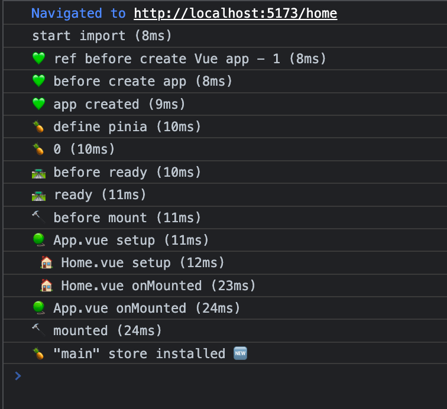

# Render Queue and timings Ionic with Vue 3 + Pinia + Router

## Documentation

- [vite](https://vitejs.dev/) - [vue](https://vuejs.org/) - [vue-router](https://router.vuejs.org/) - [pinia](https://pinia.vuejs.org/)
- [ionic](https://ionicframework.com/)

## Recommended IDE Setup

[VSCode](https://code.visualstudio.com/) + [Volar](https://marketplace.visualstudio.com/items?itemName=johnsoncodehk.volar)

## License

MIT
